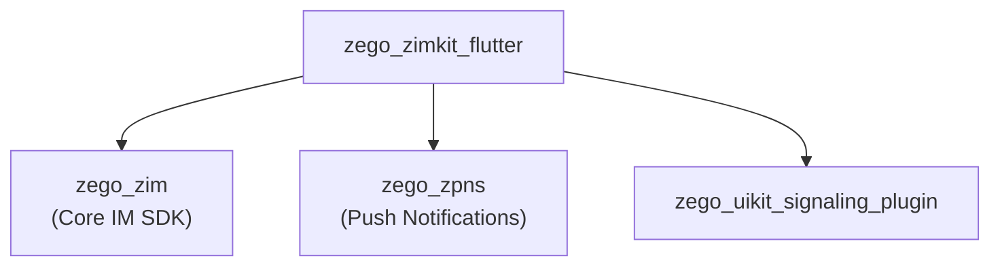
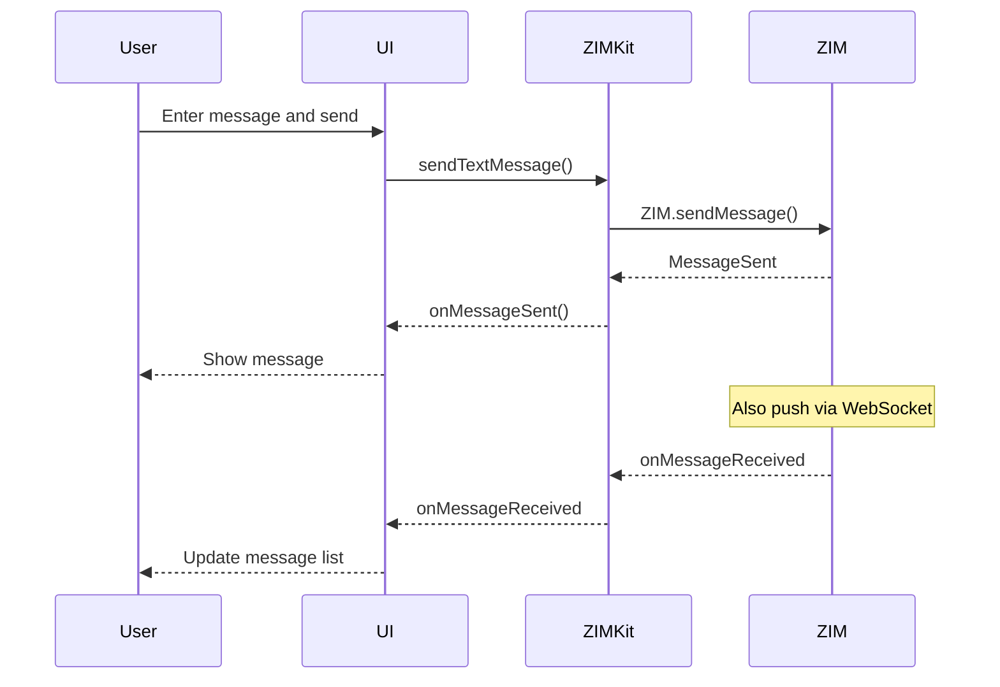

# ZegoZIMKit Architecture

> IM instant messaging suite - chat functionality

## Overview

`zego_zimkit_flutter` is an **instant messaging (IM) prebuilt UI SDK** based on ZEGO ZIM engine:

- **Conversation list**: Display all chat conversations
- **Peer/Group chat**: 1v1 and group chat
- **Message types**: Text, image, audio, video, file, etc.
- **Real-time messages**: WebSocket push
- **Message reactions**: Emoji replies
- **Message replies**: Quote replies

**Note**: This package is **independent** from other zego_uikit packages, does **NOT** depend on zego_uikit_flutter

## Package Relationship



## Core Pattern: Service Mixins

All services are aggregated into the `ZIMKit` singleton via **mixin**:

```dart
class ZIMKit
    with
        ZIMKitConversationService,
        ZIMKitMessageService,
        ZIMKitUserService,
        ZIMKitGroupService,
        ZIMKitInputService,
        ZIMKitHelperService,
        ZIMKitDefaultDialogService {
  factory ZIMKit() => instance;
}
```

## Quick Start

### 1. Initialize

```dart
import 'package:zego_zimkit/zego_zimkit.dart';

void main() async {
  WidgetsFlutterBinding.ensureInitialized();

  // Initialize ZIMKit
  await ZIMKit.init(
    appID: yourAppID,
    appSign: yourAppSign,
  );

  runApp(MyApp());
}
```

### 2. Login

```dart
// User login
await ZIMKit.login(
  userID: currentUserID,
  userName: currentUserName,
  token: userToken,  // Optional
);
```

### 3. Show Conversation List

```dart
ZIMKitConversationListView(
  onConversationItemPressed: (conversation) {
    Navigator.push(
      context,
      MaterialPageRoute(
        builder: (context) => ZIMKitMessageListPage(
          conversationID: conversation.id,
          conversationType: conversation.type,
        ),
      ),
    );
  },
)
```

### 4. Show Message List

```dart
ZIMKitMessageListPage(
  conversationID: 'conversation_id',
  conversationType: ZIMConversationType.peer,  // or .group
)
```

## Data Models

### ZIMKitConversation

```dart
class ZIMKitConversation {
  String id;                       // Conversation ID
  ZIMConversationType type;        // .peer (1v1) / .group (group)
  String name;                      // Conversation name
  String avatarUrl;                 // Avatar
  int unreadCount;                  // Unread count
  ZIMKitMessage? lastMessage;      // Last message
  DateTime? updatedAt;             // Last update time
}
```

### ZIMKitMessage

```dart
class ZIMKitMessage {
  String id;                       // Message ID
  ZIMMessageType type;             // Message type
  String content;                   // Content
  ZIMKitUser sender;               // Sender
  DateTime timestamp;               // Timestamp
  ZIMMessageSentStatus status;      // Sent status
  List<ZIMMessageReaction>? reactions;  // Reactions
  ZIMKitMessage? replyMessage;     // Replied message
}
```

## Message Types

| Type | Description | Component |
|------|-------------|-----------|
| `text` | Text message | `ZIMKitTextMessage` |
| `image` | Image message | `ZIMKitImageMessage` |
| `video` | Video message | `ZIMKitVideoMessage` |
| `audio` | Audio message | `ZIMKitAudioMessage` |
| `file` | File message | `ZIMKitFileMessage` |
| `url` | URL message | `ZIMKitURLMessage` |
| `revoke` | Revoked message | `ZIMKitRevokeMessage` |
| `gif` | GIF message | `ZIMKitGIFMessage` |

## Services

### ZIMKitConversationService

Conversation management:

```dart
// Get conversation list
final conversations = await ZIMKit().conversationService.getConversationList();

// Delete conversation
await ZIMKit().conversationService.deleteConversation(conversationID);

// Listen for conversation list changes
ZIMKit().conversationService.onConversationListChanged.listen((conversations) {
  // Update UI
});
```

### ZIMKitMessageService

Message management:

```dart
// Send text message
final message = await ZIMKit().messageService.sendTextMessage(
  conversationID: conversationID,
  content: 'Hello!',
);

// Send image message
final message = await ZIMKit().messageService.sendImageMessage(
  conversationID: conversationID,
  imagePath: '/path/to/image.jpg',
);

// Revoke message
await ZIMKit().messageService.revokeMessage(messageID, conversationID);

// Add reaction
await ZIMKit().messageService.addReaction(messageID, conversationID, '👍');

// Listen for new messages
ZIMKit().messageService.onMessageReceived.listen((message, conversation) {
  // Handle new message
});
```

### ZIMKitGroupService

Group management:

```dart
// Create group
final groupInfo = await ZIMKit().groupService.createGroup(
  userIDs: ['user1', 'user2', 'user3'],
  groupName: 'My Group',
);

// Invite to group
await ZIMKit().groupService.inviteUsers(['user4'], groupID);

// Kick from group
await ZIMKit().groupService.kickUsers(['user3'], groupID);

// Get group members
final members = await ZIMKit().groupService.queryGroupMemberList(groupID);
```

### ZIMKitUserService

User service:

```dart
// Update user info
await ZIMKit().userService.updateUserName('New Name');
await ZIMKit().userService.updateUserAvatar('https://avatar.url');

// Query user
final userInfo = await ZIMKit().userService.queryUserInfo(userID);
```

## Configuration

### ZIMKitConfig

```dart
ZIMKit(
  config: ZIMKitConfig(
    // Conversation config
    conversationConfig: ZIMKitConversationConfig(
      showAvatar: true,
      showTimestamp: true,
    ),
    // Message config
    messageConfig: ZIMKitMessageConfig(
      showAvatar: true,
      showTimestamp: true,
      maxImageWidth: 200,
      maxImageHeight: 200,
    ),
    // Input config
    inputConfig: ZIMKitInputConfig(
      showEmoji: true,
      showMedia: true,
      showFile: true,
      showVoice: true,
    ),
  ),
)
```

## Events

```dart
ZIMKit(
  events: ZIMKitEvents(
    // Conversation events
    onConversationListChanged: (conversations) {},

    // Message events
    onMessageReceived: (message, conversation) {},
    onMessageSent: (message, conversation) {},
    onMessageStatusChanged: (message, status) {},

    // Reaction events
    onMessageReactionUpdated: (message) {},

    // Group events
    onGroupCreated: (groupInfo) {},
    onGroupJoined: (groupInfo) {},
    onGroupLeft: (groupInfo) {},
    onGroupMemberJoined: (groupInfo, user) {},
    onGroupMemberLeft: (groupInfo, user) {},

    // Connection state
    onConnectionStateChanged: (state) {},
  ),
)
```

## Directory Structure

```
lib/src/
├── zimkit.dart                # Main entry (ZIMKit singleton)
├── services/                  # Service layer
│   ├── services.dart           # Services export
│   ├── zimkit_services.dart   # ZIMKit services config
│   ├── conversation_service.dart
│   ├── message_service.dart
│   ├── group_service.dart
│   ├── user_service.dart
│   ├── input_service.dart
│   ├── helper_service.dart
│   └── core/
│       └── core.dart          # ZIMKitCore singleton
├── components/              # UI components
│   ├── components.dart
│   ├── conversation_list.dart     # Conversation list
│   ├── conversation.dart          # Conversation component
│   ├── message_list.dart          # Message list
│   ├── message_input.dart         # Message input
│   ├── defines.dart
│   ├── messages/                 # Message type components
│   │   ├── text_message.dart
│   │   ├── image_message.dart
│   │   ├── video_message.dart
│   │   ├── audio_message.dart
│   │   ├── file_message.dart
│   │   ├── url_message.dart
│   │   └── ...
│   ├── common/              # Common components
│   │   └── avatar.dart
│   └── ...
├── pages/                   # Pages
│   ├── message_list_page.dart    # Message list page
│   └── pages.dart
├── events/                  # Event definitions
├── utils/                   # Utilities
├── callkit/                 # Call integration
├── channel/                 # Platform channel
└── internal/               # Internal
```

## Message Flow



## Integration with Call SDK

ZIMKit can be used with ZegoUIKitPrebuiltCall:

```dart
class ChatPage extends StatelessWidget {
  @override
  Widget build(BuildContext context) {
    return Scaffold(
      body: ZIMKitMessageListPage(
        conversationID: conversationID,
      ),
      floatingActionButton: FloatingActionButton(
        onPressed: () {
          // Start audio/video call
          Navigator.push(
            context,
            MaterialPageRoute(
              builder: (context) => ZegoUIKitPrebuiltCall(
                appID: appID,
                appSign: appSign,
                userID: userID,
                userName: userName,
                callID: callID,
                config: ZegoUIKitPrebuiltCallConfig.oneOnOneVideoCall(),
              ),
            ),
          );
        },
        child: Icon(Icons.videocam),
      ),
    );
  }
}
```

## Common Issues & Solutions

### 1. Message Send Failed

Check network and login status:

```dart
// Listen for connection state
ZIMKit().connectionStateNotifier.addListener(() {
  if (ZIMKit().connectionState == ZIMConnectionState.connected) {
    // Connected, can send messages
  }
});
```

### 2. Unread Count Inaccurate

```dart
// Mark conversation as read
await ZIMKit().conversationService.markConversationAsRead(conversationID);
```

### 3. Image Message Send Slow

Large images should be compressed first:

```dart
// Compress image before using messageService
final compressedPath = await compressImage(imagePath);
await ZIMKit().messageService.sendImageMessage(
  conversationID: id,
  imagePath: compressedPath,
);
```

## Key Dependencies

| Package | Version | Purpose |
|---------|---------|---------|
| `zego_zim` | ^2.21.1+1 | Core IM SDK |
| `zego_zpns` | ^2.8.0 | Push notifications |
| `zego_uikit_signaling_plugin` | ^2.8.20 | Signaling/call |
| `provider` | - | State management |
| `emoji_picker_flutter` | - | Emoji picker |
| `file_picker` | - | File picking |

## Related Documentation

- [ZegoUIKitPrebuiltCall Architecture](../zego_uikit_prebuilt_call_flutter/ARCHITECTURE.md)
