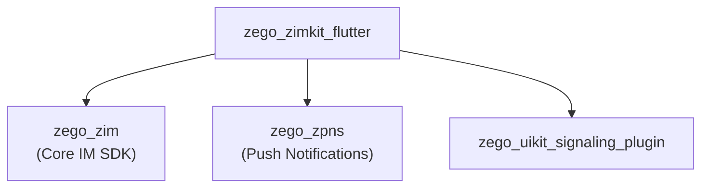
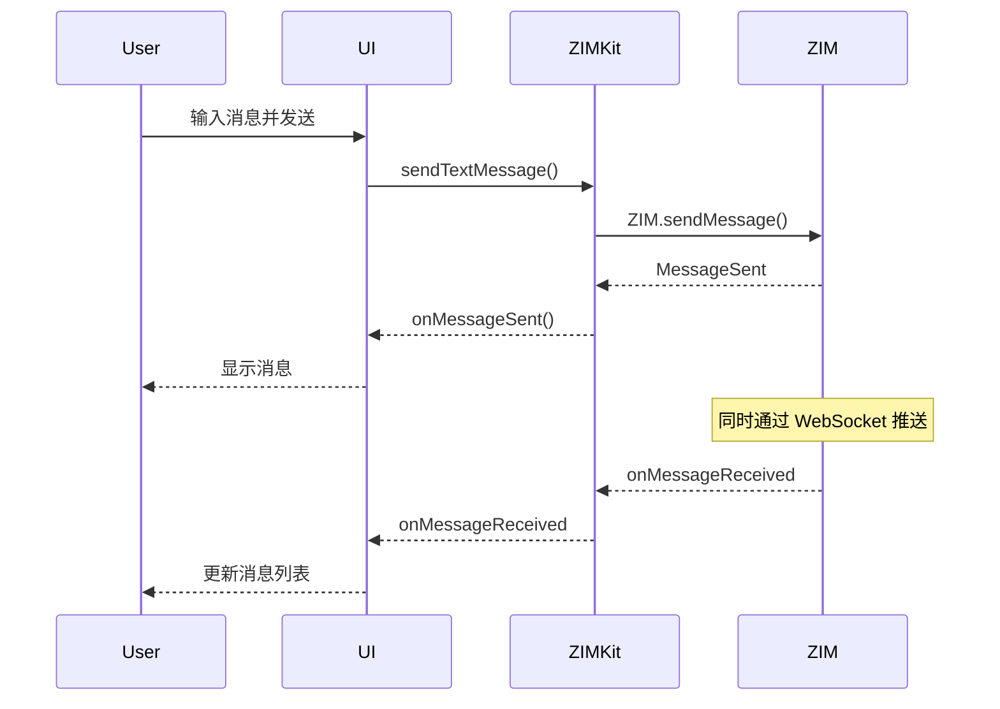

# ZegoZIMKit Architecture

> IM 即时通讯套件 - 聊天功能

## Overview

`zego_zimkit_flutter` 是**即时通讯 (IM) 预构建 UI SDK**，基于 ZEGO ZIM 引擎：

- **会话列表**: 展示所有聊天会话
- **单聊/群聊**: 1v1 和群组聊天
- **消息类型**: 文本、图片、语音、视频、文件等
- **实时消息**: WebSocket 推送
- **消息反应**: 表情回复
- **消息回复**: 引用回复

**注意**: 此包**独立于**其他 zego_uikit 包，**不依赖** zego_uikit_flutter

## Package Relationship



## Core Pattern: Service Mixins

所有服务都通过 **mixin** 聚合到 `ZIMKit` 单例：

```dart
class ZIMKit
    with
        ZIMKitConversationService,
        ZIMKitMessageService,
        ZIMKitUserService,
        ZIMKitGroupService,
        ZIMKitInputService,
        ZIMKitHelperService,
        ZIMKitDefaultDialogService {
  factory ZIMKit() => instance;
}
```

## Quick Start

### 1. 初始化

```dart
import 'package:zego_zimkit/zego_zimkit.dart';

void main() async {
  WidgetsFlutterBinding.ensureInitialized();

  // 初始化 ZIMKit
  await ZIMKit.init(
    appID: yourAppID,
    appSign: yourAppSign,
  );

  runApp(MyApp());
}
```

### 2. 登录

```dart
// 用户登录
await ZIMKit.login(
  userID: currentUserID,
  userName: currentUserName,
  token: userToken,  // 可选
);
```

### 3. 展示会话列表

```dart
ZIMKitConversationListView(
  onConversationItemPressed: (conversation) {
    Navigator.push(
      context,
      MaterialPageRoute(
        builder: (context) => ZIMKitMessageListPage(
          conversationID: conversation.id,
          conversationType: conversation.type,
        ),
      ),
    );
  },
)
```

### 4. 展示消息列表

```dart
ZIMKitMessageListPage(
  conversationID: 'conversation_id',
  conversationType: ZIMConversationType.peer,  // 或 .group
)
```

## Data Models

### ZIMKitConversation

```dart
class ZIMKitConversation {
  String id;                       // 会话 ID
  ZIMConversationType type;        // .peer (单聊) / .group (群聊)
  String name;                     // 会话名称
  String avatarUrl;                // 头像
  int unreadCount;                 // 未读数
  ZIMKitMessage? lastMessage;      // 最后一条消息
  DateTime? updatedAt;             // 最后更新时间
}
```

### ZIMKitMessage

```dart
class ZIMKitMessage {
  String id;                       // 消息 ID
  ZIMMessageType type;              // 消息类型
  String content;                   // 内容
  ZIMKitUser sender;                // 发送者
  DateTime timestamp;               // 时间戳
  ZIMMessageSentStatus status;      // 发送状态
  List<ZIMMessageReaction>? reactions;  // 反应
  ZIMKitMessage? replyMessage;     // 回复的消息
}
```

## Message Types

| Type | 说明 | 组件 |
|------|------|------|
| `text` | 文本消息 | `ZIMKitTextMessage` |
| `image` | 图片消息 | `ZIMKitImageMessage` |
| `video` | 视频消息 | `ZIMKitVideoMessage` |
| `audio` | 语音消息 | `ZIMKitAudioMessage` |
| `file` | 文件消息 | `ZIMKitFileMessage` |
| `url` | 链接消息 | `ZIMKitURLMessage` |
| `revoke` | 撤回消息 | `ZIMKitRevokeMessage` |
| `gif` | GIF 消息 | `ZIMKitGIFMessage` |

## Services

### ZIMKitConversationService

会话管理：

```dart
// 获取会话列表
final conversations = await ZIMKit().conversationService.getConversationList();

// 删除会话
await ZIMKit().conversationService.deleteConversation(conversationID);

// 监听会话列表变化
ZIMKit().conversationService.onConversationListChanged.listen((conversations) {
  // 更新 UI
});
```

### ZIMKitMessageService

消息管理：

```dart
// 发送文本消息
final message = await ZIMKit().messageService.sendTextMessage(
  conversationID: conversationID,
  content: 'Hello!',
);

// 发送图片消息
final message = await ZIMKit().messageService.sendImageMessage(
  conversationID: conversationID,
  imagePath: '/path/to/image.jpg',
);

// 撤回消息
await ZIMKit().messageService.revokeMessage(messageID, conversationID);

// 添加反应
await ZIMKit().messageService.addReaction(messageID, conversationID, '👍');

// 监听新消息
ZIMKit().messageService.onMessageReceived.listen((message, conversation) {
  // 处理新消息
});
```

### ZIMKitGroupService

群组管理：

```dart
// 创建群组
final groupInfo = await ZIMKit().groupService.createGroup(
  userIDs: ['user1', 'user2', 'user3'],
  groupName: 'My Group',
);

// 邀请加入群组
await ZIMKit().groupService.inviteUsers(['user4'], groupID);

// 从群组移除
await ZIMKit().groupService.kickUsers(['user3'], groupID);

// 获取群成员
final members = await ZIMKit().groupService.queryGroupMemberList(groupID);
```

### ZIMKitUserService

用户服务：

```dart
// 更新用户信息
await ZIMKit().userService.updateUserName('New Name');
await ZIMKit().userService.updateUserAvatar('https://avatar.url');

// 查询用户
final userInfo = await ZIMKit().userService.queryUserInfo(userID);
```

## Configuration

### ZIMKitConfig

```dart
ZIMKit(
  config: ZIMKitConfig(
    // 会话配置
    conversationConfig: ZIMKitConversationConfig(
      showAvatar: true,
      showTimestamp: true,
    ),
    // 消息配置
    messageConfig: ZIMKitMessageConfig(
      showAvatar: true,
      showTimestamp: true,
      maxImageWidth: 200,
      maxImageHeight: 200,
    ),
    // 输入框配置
    inputConfig: ZIMKitInputConfig(
      showEmoji: true,
      showMedia: true,
      showFile: true,
      showVoice: true,
    ),
  ),
)
```

## Events

```dart
ZIMKit(
  events: ZIMKitEvents(
    // 会话事件
    onConversationListChanged: (conversations) {},

    // 消息事件
    onMessageReceived: (message, conversation) {},
    onMessageSent: (message, conversation) {},
    onMessageStatusChanged: (message, status) {},

    // 反应事件
    onMessageReactionUpdated: (message) {},

    // 群组事件
    onGroupCreated: (groupInfo) {},
    onGroupJoined: (groupInfo) {},
    onGroupLeft: (groupInfo) {},
    onGroupMemberJoined: (groupInfo, user) {},
    onGroupMemberLeft: (groupInfo, user) {},

    // 连接状态
    onConnectionStateChanged: (state) {},
  ),
)
```

## Directory Structure

```
lib/src/
├── zimkit.dart                # 主入口 (ZIMKit 单例)
├── services/                  # 服务层
│   ├── services.dart           # 服务导出
│   ├── zimkit_services.dart   # ZIMKit 服务配置
│   ├── conversation_service.dart
│   ├── message_service.dart
│   ├── group_service.dart
│   ├── user_service.dart
│   ├── input_service.dart
│   ├── helper_service.dart
│   └── core/
│       └── core.dart          # ZIMKitCore 单例
├── components/              # UI 组件
│   ├── components.dart
│   ├── conversation_list.dart     # 会话列表
│   ├── conversation.dart          # 会话组件
│   ├── message_list.dart          # 消息列表
│   ├── message_input.dart         # 消息输入框
│   ├── defines.dart
│   ├── messages/                 # 消息类型组件
│   │   ├── text_message.dart
│   │   ├── image_message.dart
│   │   ├── video_message.dart
│   │   ├── audio_message.dart
│   │   ├── file_message.dart
│   │   ├── url_message.dart
│   │   └── ...
│   ├── common/              # 通用组件
│   │   └── avatar.dart
│   └── ...
├── pages/                   # 页面
│   ├── message_list_page.dart    # 消息列表页
│   └── pages.dart
├── events/                  # 事件定义
├── utils/                   # 工具
├── callkit/                 # 通话集成
├── channel/                 # 平台通道
└── internal/               # 内部
```

## Message Flow



## Integration with Call SDK

ZIMKit 可以与 ZegoUIKitPrebuiltCall 配合使用：

```dart
class ChatPage extends StatelessWidget {
  @override
  Widget build(BuildContext context) {
    return Scaffold(
      body: ZIMKitMessageListPage(
        conversationID: conversationID,
      ),
      floatingActionButton: FloatingActionButton(
        onPressed: () {
          // 启动音视频通话
          Navigator.push(
            context,
            MaterialPageRoute(
              builder: (context) => ZegoUIKitPrebuiltCall(
                appID: appID,
                appSign: appSign,
                userID: userID,
                userName: userName,
                callID: callID,
                config: ZegoUIKitPrebuiltCallConfig.oneOnOneVideoCall(),
              ),
            ),
          );
        },
        child: Icon(Icons.videocam),
      ),
    );
  }
}
```

## Common Issues & Solutions

### 1. 消息发送失败

检查网络和登录状态：

```dart
// 监听连接状态
ZIMKit().connectionStateNotifier.addListener(() {
  if (ZIMKit().connectionState == ZIMConnectionState.connected) {
    // 已连接，可以发送消息
  }
});
```

### 2. 消息未读数不准确

```dart
// 标记会话已读
await ZIMKit().conversationService.markConversationAsRead(conversationID);
```

### 3. 图片消息发送慢

大图片建议先压缩：

```dart
// 使用 messageService 前压缩图片
final compressedPath = await compressImage(imagePath);
await ZIMKit().messageService.sendImageMessage(
  conversationID: id,
  imagePath: compressedPath,
);
```

## Key Dependencies

| Package | Version | Purpose |
|---------|---------|---------|
| `zego_zim` | ^2.21.1+1 | 核心 IM SDK |
| `zego_zpns` | ^2.8.0 | 推送通知 |
| `zego_uikit_signaling_plugin` | ^2.8.20 | 信令/通话 |
| `provider` | - | 状态管理 |
| `emoji_picker_flutter` | - | 表情选择 |
| `file_picker` | - | 文件选择 |

## Related Documentation

- [ZegoUIKitPrebuiltCall Architecture](../zego_uikit_prebuilt_call_flutter/ARCHITECTURE.md)